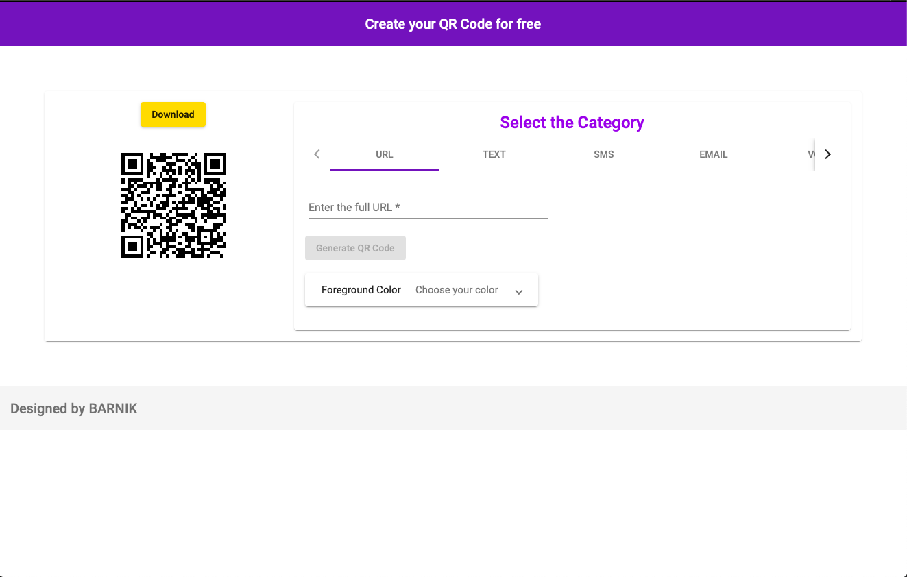
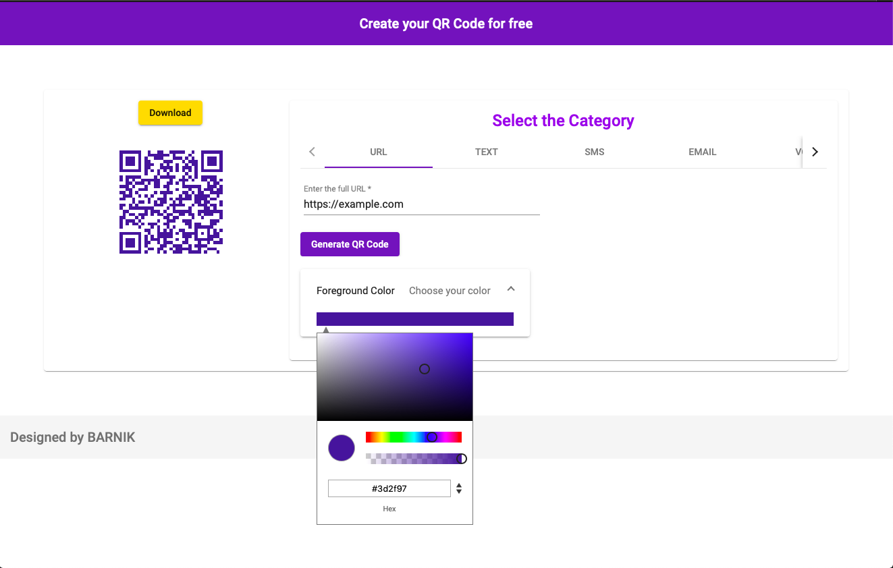
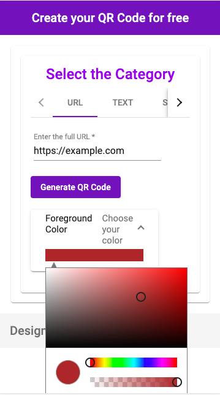
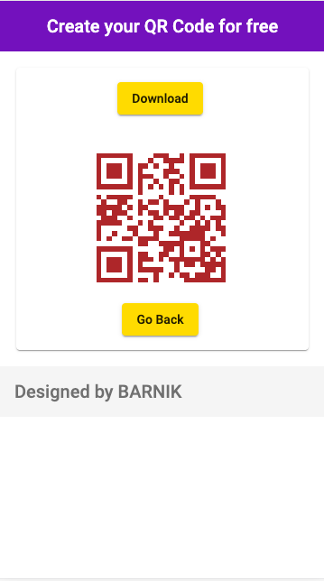

# Qr Code Generator

This is a simple QR code generator built with Angular 7.3.4.

You can generate QR codes for free under 5 different categories namely URL, Plain Text, SMS, Email and vCard.

The QR codes generated can also be customised with different colors.

## Sample Images

#### Desktop Samples

 

#### Mobile Samples

 

## Run locally

* Install [npm](https://www.npmjs.com/get-npm) globally if not present
* Clone the repository into your local machine
* Run npm install inside the base directory in your local machine
* To start a dev server run `ng serve` and navigate to `http://localhost:4200/` in your browser

## Issues/Contributions

If you want to report an __issue__ please raise an issue in the repo.

If you want to __contribute__ in any way, do raise a PR into develop :smiley:. 

